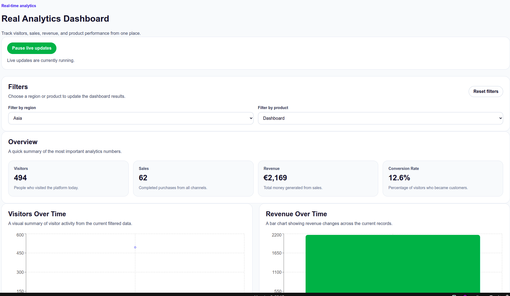
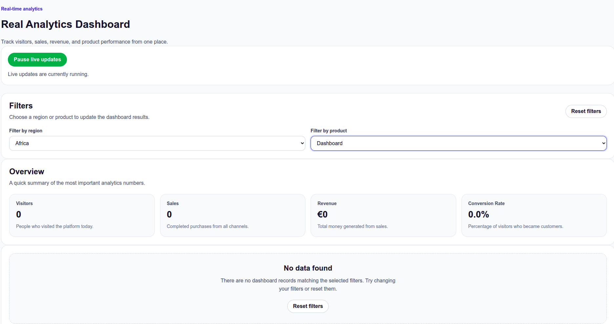
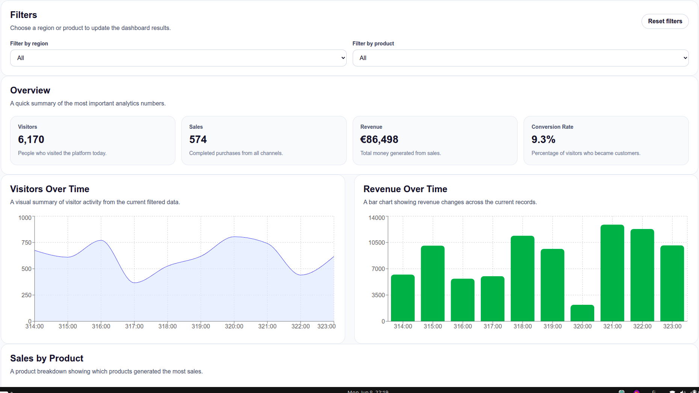

# Realtime Analytics Dashboard

A responsive real-time analytics dashboard built with **React**, **TypeScript**, **Vite** and **Recharts**.

Live demo: https://realtime-analytics-dashboard-eight.vercel.app/

The dashboard displays simulated business analytics data with KPI cards, filters, charts, a data table, live updates, and empty state handling.

## Live Demo

[View the live dashboard](https://realtime-analytics-dashboard-eight.vercel.app/)

---

## Project Preview





---

## Features

- Real-time simulated dashboard updates
- Pause and resume live updates
- KPI cards for:
  - Visitors
  - Sales
  - Revenue
  - Conversion rate
- Filter data by:
  - Region
  - Product
- Reset filters
- Empty state when no data matches the selected filters
- Responsive charts using Recharts
- Detailed analytics table
- Reusable React components
- Custom hook for dashboard data logic
- TypeScript types for safer data handling
- Responsive layout for desktop, tablet, and mobile

---

## Tech Stack

- React
- TypeScript
- Vite
- Recharts
- CSS
- Git and GitHub

---

## How the App Works

The app starts with mock analytics data stored locally in the project.

The dashboard uses a custom hook called `useDashboardData` to manage the main data logic:

- Stores dashboard records in state
- Stores selected filters in state
- Filters the data based on region and product
- Calculates total visitors, sales, revenue, and conversion rate
- Simulates real-time updates using `setInterval`
- Allows live updates to be paused and resumed
- Resets filters back to the default values

The UI is split into reusable components such as:

- `DashboardHeader`
- `DashboardFilters`
- `StatCard`
- `LiveUpdateControl`
- `DashboardTable`
- `VisitorsChart`
- `RevenueChart`
- `ProductSalesChart`
- `EmptyState`

This structure keeps the app easier to maintain and extend.

---

## How Users Can Use It

Users can:

1. View the overall dashboard summary.
2. See key metrics such as visitors, sales, revenue, and conversion rate.
3. Filter analytics data by region.
4. Filter analytics data by product.
5. Pause or resume real-time updates.
6. View charts for visitors, revenue, and product sales.
7. Read the detailed data table.
8. Reset filters if they want to return to the full dashboard view.

---

## Screenshots

### Dashboard Overview


### Filters


### Empty State


---

## Getting Started

### 1. Clone the repository

```bash
git clone https://github.com/benk1/realtime-analytics-dashboard.git
```
